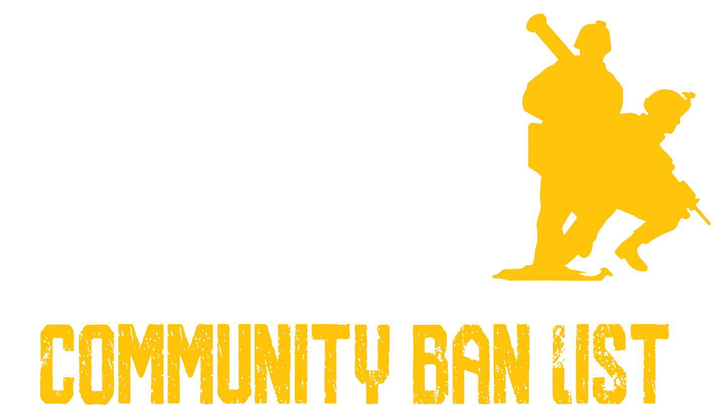

#### Squad Community Ban List

##### [Squad Community Ban List Website](https://squad-community-ban-list.com/)

  

## About
The aim of the Squad Community Ban List ("SCBL"), is to protect the Squad community's integrity through collaboration and information sharing. This is achieved by compiling ban information from some of the largest and most reputable server organisations within the Squad community, that we have partnered with, and sharing this compiled information via BattleMetrics ban lists or remote ban lists to allow all server organisations to secure their servers from known malicious players.

## How it Works
1. Information on bans issued by our partner organisations is retrieved frequently from BattleMetrics by our automated ban importer via the BattleMetrics API and is saved into our database. Our database can be searched via our [Search page](https://squad-community-ban-list.com/search) to allow server organisations to lookup a player's reputation and for players to easily find out where they are banned and how they can appeal these bans with our partner organisations.
2. Server organisations are able to [create and configure export ban lists](https://squad-community-ban-list.com/install) be specifying high customizable criteria that dictates which malicious players should be included within their export ban list.
3. Our ban generator rapidly updates export ban lists with new information that has been imported into the database to ensure that malicious players are removed and bared from playing on other server organisation's server as quickly as possible to limit the harm they cause to the server's community and the wider Squad community.